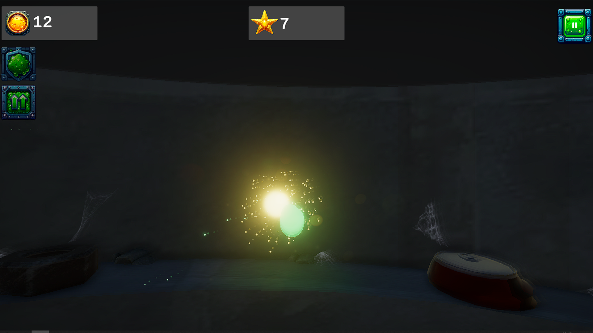
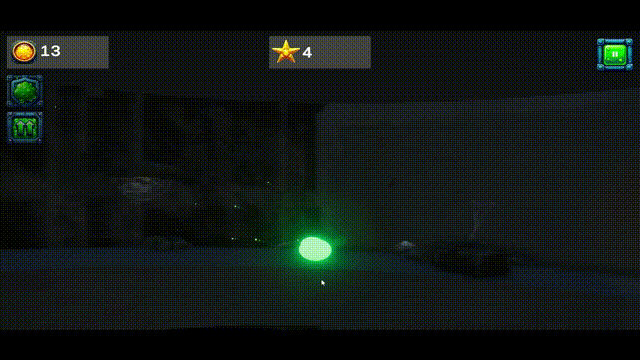

# Slime Dash 3D (Legacy Project) 🟢

Archive project of a 3D arcade game inspired by Geometry Dash,  
developed for the **Yandex Games** platform.

### About the Project:
* **Engine:** Unity  
* **Language:** C#  
* **Platform:** WebGL (Yandex Games)  
* **Graphics:** 3D  

## 📸 Screenshots

### Description
This is one of my early 3D game development projects.  
The player controls a **slime character** that constantly moves forward inside a **cylindrical tunnel**, similar to a sewer environment.

### Features:
- Fast-paced arcade gameplay  
- Slime character with simple animations  
- Movement along a tunnel (up / down mechanics)  
- Main menu with sound effects  
- Basic post-processing effects  
- Casual difficulty curve  

### Notes:
It reflects my early experience with:
- 3D movement systems  
- Arcade-style gameplay design  
- UI menus and sound integration  
- WebGL builds for Yandex Games  

### Status
🗃️ **Legacy / Archive project**  
No active development — kept for documentation and personal growth tracking.

---

**NuerisCore**  
Physics • AI • GameDev  

My Games: [[YGames](https://yandex.ru/games/developer/78635)]  
YouTube: [[MyYouTube Channel](https://youtube.com/channel/UC9tkLMP-mpi883nc5ktMYNg)]  
Telegram: [[MyTelegram](https://t.me/fomooe)]